# Enterprise-Grade CI/CD with GitHub Actions (OIDC & Managed Deployment)
## 📌 Overview

This project demonstrates a production-quality CI/CD pipeline implemented using modern DevOps best practices.
The focus is on security, automation, reliability, and cost efficiency, reflecting how real-world engineering teams deliver applications using managed cloud platforms.

The pipeline is built with GitHub Actions and emphasizes:

## 🔐 Keyless authentication using OIDC (no long-lived cloud credentials)

### 🔄 Automated CI workflows (tests, validation, security checks)

### 🚀 Managed deployment using Render

### 📉 Zero / very low cost, suitable for coursework and portfolios

### 📄 Clear documentation aligned with real infrastructure

## 🏗️ Architecture Design
Developer
↓
GitHub Repository
↓
GitHub Actions (CI/CD + OIDC)
↓
Render.com (Managed Deployment)

## 🧠 Architecture Rationale

GitHub Actions handles CI/CD automation and workflow orchestration

OIDC provides short-lived, identity-based credentials without secrets

Render manages infrastructure, networking, and rolling deployments

No self-managed servers (EC2 / NGINX) are required

This design avoids unnecessary complexity while remaining production-realistic and secure.

## 🔄 CI/CD Pipeline Stages
### 1️⃣ Development

Application developed locally

Version-controlled using Git

Health endpoint included for runtime validation

### 2️⃣ Continuous Integration (CI)

Triggered on:

push

pull_request

Steps performed:

Dependency installation

Automated tests

Linting and basic validation

Build verification

### 3️⃣ Security & Quality Controls

Dependency vulnerability scanning (npm audit)

No secrets committed to the repository

Identity-based authentication via OIDC

Least-privilege IAM role access

### 4️⃣ Release & Versioning

Semantic versioning (vMAJOR.MINOR.PATCH)

GitHub Releases automatically created from tags

Clear and auditable release history

### 5️⃣ Deployment (Managed Platform)

GitHub Actions triggers deployment

Render performs rolling updates

Traffic is shifted only after successful health checks

Zero-downtime behavior handled by the platform

## 🔐 Security Design — GitHub Actions OIDC

This project uses GitHub Actions OpenID Connect (OIDC) to authenticate with AWS without access keys.

### Why OIDC?

Eliminates long-lived credentials

Reduces blast radius

Aligns with modern cloud security best practices

Fully auditable and identity-based

### Authentication Flow
GitHub Actions
→ OIDC Token
→ AWS STS
→ IAM Role
→ Temporary Credentials

### ⚠️ AWS is used only to demonstrate secure OIDC authentication.
No AWS infrastructure (EC2, ECS, S3, etc.) is deployed.

## 🔐 AWS IAM Configuration
### A️ IAM Role Trust Policy (OIDC)

This trust policy allows only this GitHub repository to assume the IAM role using OIDC.

{
  "Version": "2012-10-17",
  "Statement": [
    {
      "Effect": "Allow",
      "Principal": {
        "Federated": "arn:aws:iam::925213603952:oidc-provider/token.actions.githubusercontent.com"
      },
      "Action": "sts:AssumeRoleWithWebIdentity",
      "Condition": {
        "StringEquals": {
          "token.actions.githubusercontent.com:aud": "sts.amazonaws.com"
        },
        "StringLike": {
          "token.actions.githubusercontent.com:sub": "repo:FIDMANN-TECH/deployment-pipelines-cloud-platforms:*"
        }
      }
    }
  ]
}

### B️ IAM Permissions Policy (Minimal Example)

This policy defines what the role can do after being assumed.
Permissions are intentionally minimal for demonstration purposes.

{
  "Version": "2012-10-17",
  "Statement": [
    {
      "Effect": "Allow",
      "Action": [
        "sts:GetCallerIdentity"
      ],
      "Resource": "*"
    }
  ]
}

ℹ️ In real production deployments, additional permissions would be granted based on the target platform or service.

## 📊 Observability & Validation

Health endpoint (/health)

GitHub Actions workflow logs

Deployment status from Render dashboard

These provide sufficient visibility without paid monitoring tools.

## 💰 Cost Optimization

This project was intentionally designed to remain free or very low cost:

Service	Cost
GitHub Actions	Free
Render	Free
AWS IAM / OIDC	Free
Monitoring	Free
🛠️ Troubleshooting

Common issues addressed:

YAML syntax errors

IAM trust policy mismatches

OIDC audience or repository scope errors

Failed builds or tests

Primary debugging source:

GitHub Actions logs

## ✅ Conclusion

This project demonstrates how modern DevOps teams implement secure, automated, and cost-efficient CI/CD pipelines using GitHub Actions, OIDC-based authentication, and managed deployment platforms.

## Below are screenshots of workflow:

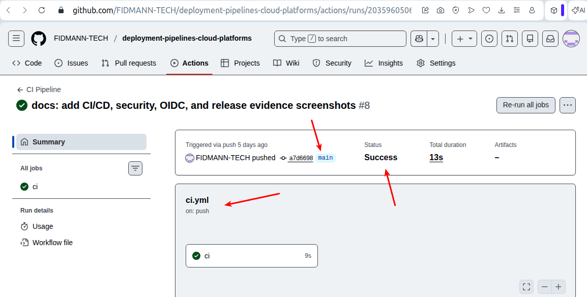
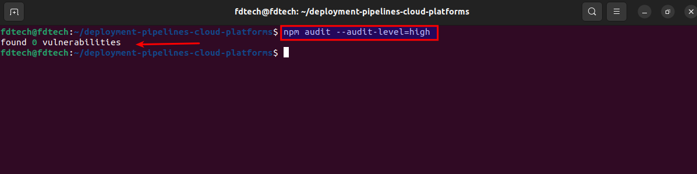
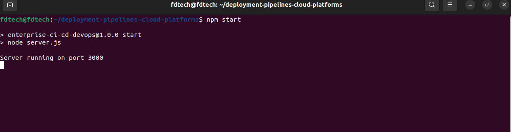

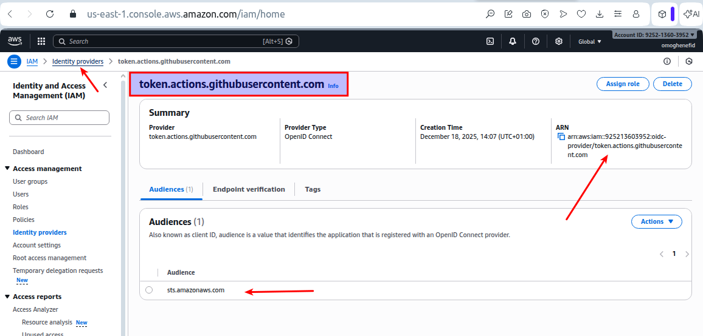
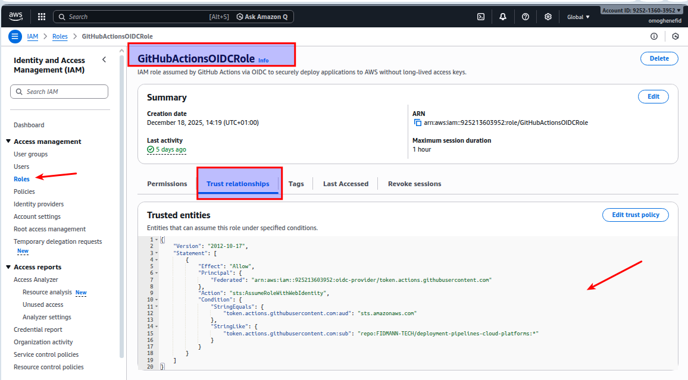
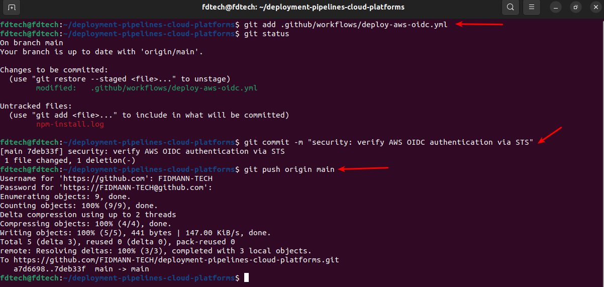
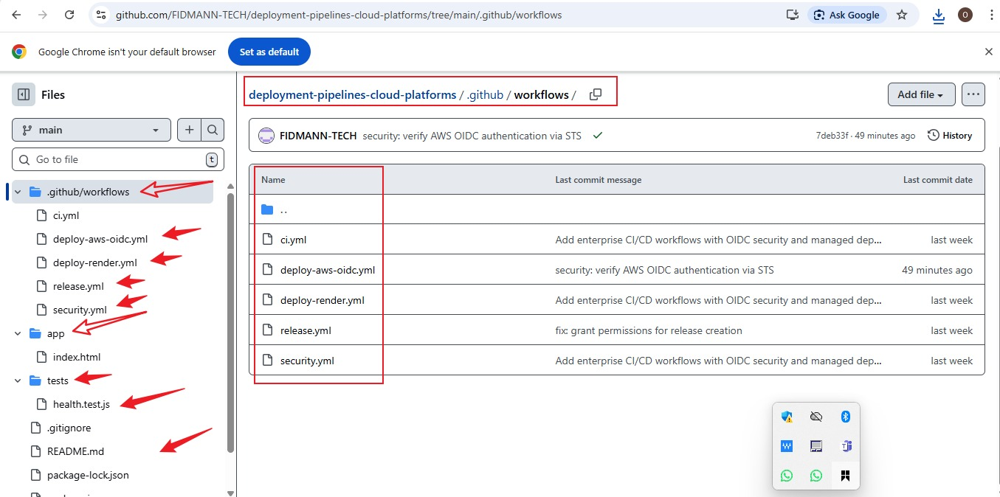
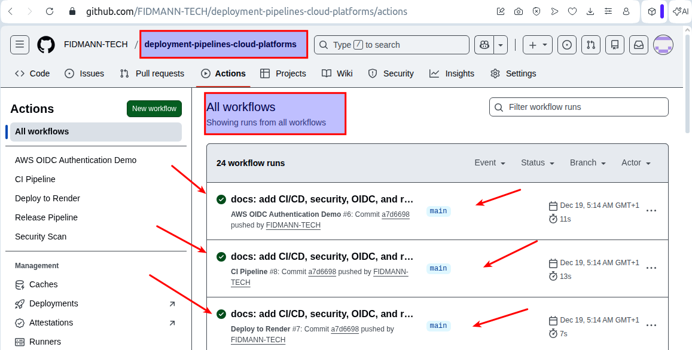
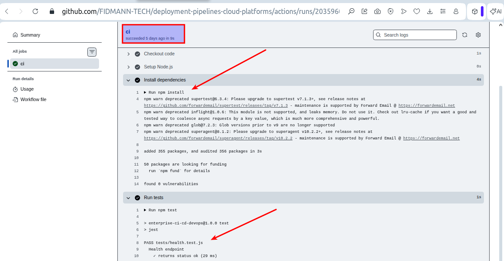
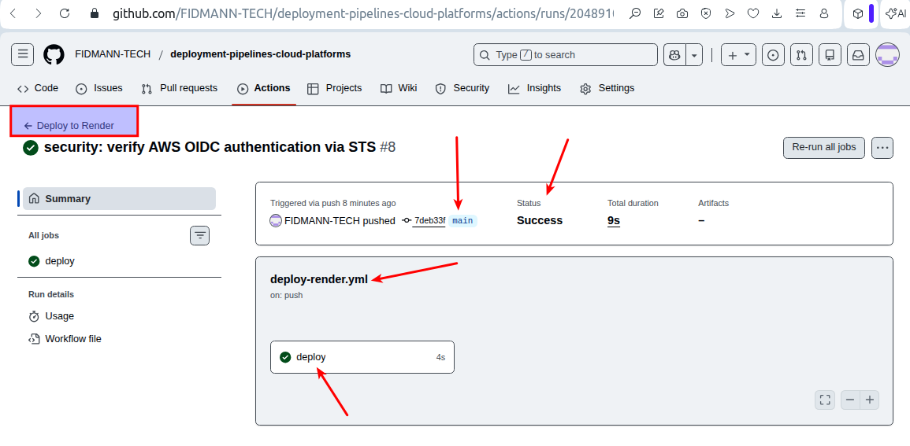
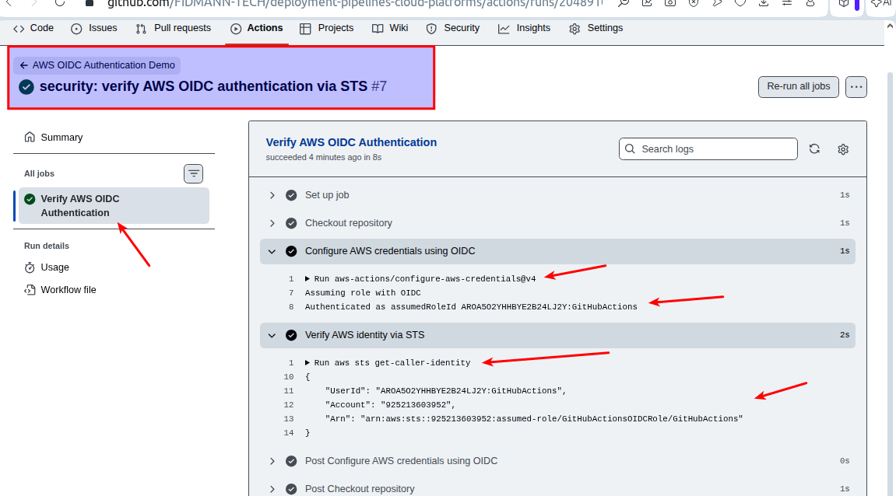
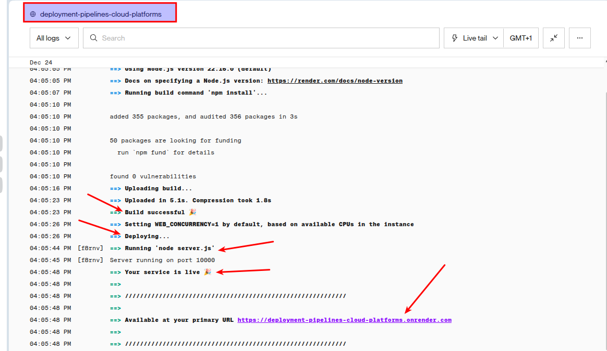
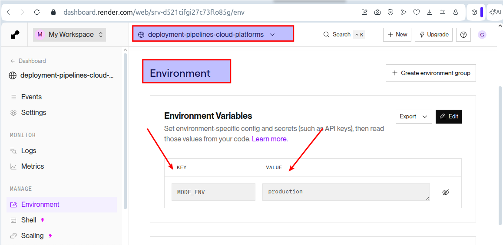
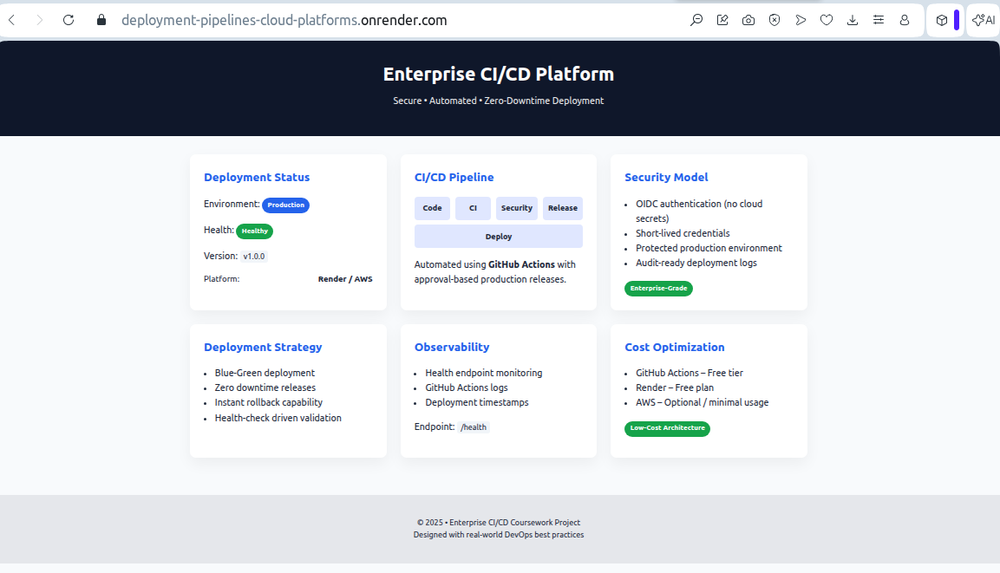
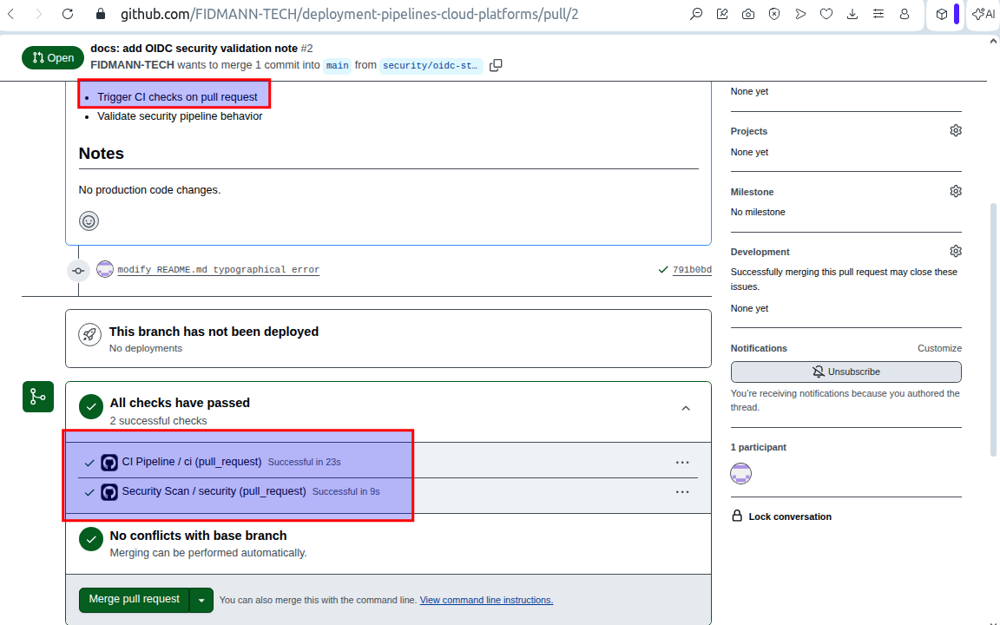
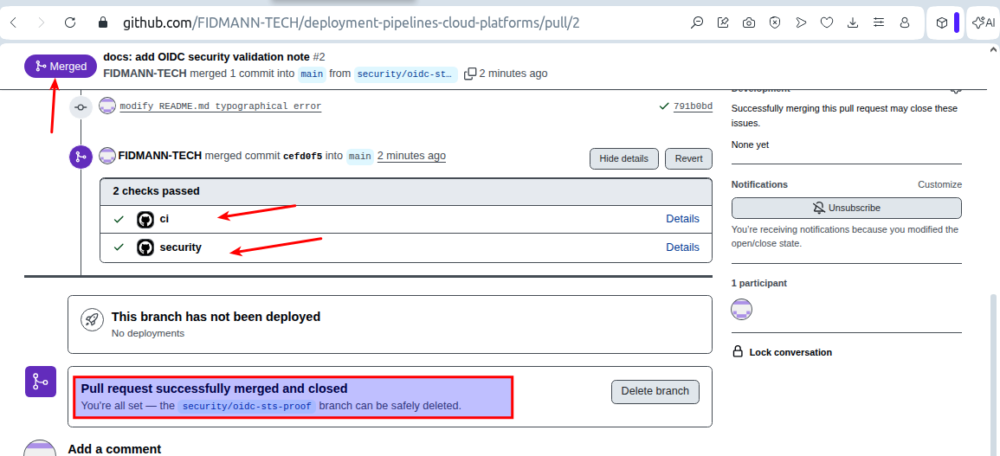
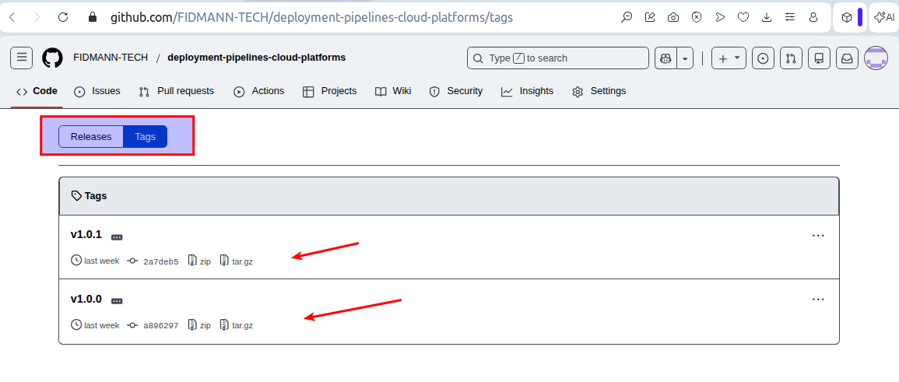
